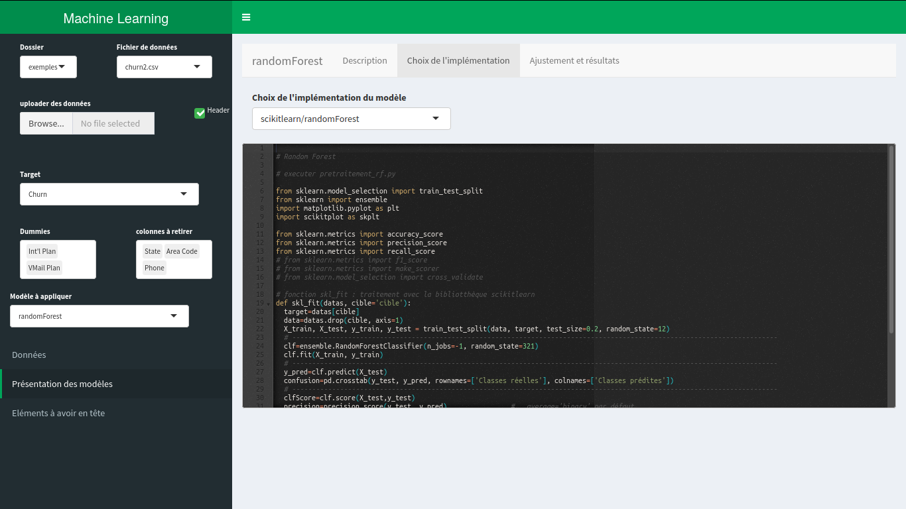

Objectif naïf du projet mlExplore
---------------------------------

Permettre aux utilisateurs de sélectionner des modèles de **M**achine
**L**earning compatibles avec leurs données.

Bien souvent, de nombreuses implémentations existent, sous R et sous
Python pour ne s’en tenir qu’à ces deux langages.

Le but est de s’y retrouver tout en s’affranchissant de la barrière …de
la langue !

Pour le modèle sélectionné, le choix d’une implémentation est proposé
avec (si possible) :

-   scikit-learn, donc en Python

-   ou bien R + packages spécialisés

De quoi s’agit-il vraiment ?
----------------------------

### =\> Un outil pédagogique

Tout l’intérêt du projet ne se résume pas au produit final et
certainement pas à ses capacités de calcul :

Des outils graphiques pour gérer des problèmes ML, il en existe déjà
beaucoup

-   GCP
-   MatLab (The MathWorks)

**On pourra continuer la liste non exhaustive**

L’outil produit ici ne peut concurrencer sur le fond les acteurs
spécilistes du domaine depuis des années.

Il apporte plutôt une dimension pédagogique en présentant aux
*utilisateurs*

-   des algorithmes,
-   des modèles,
-   un concentré d’éléments de connaissances relatives au ML, adapté *à
    eux* puisque enrichi *par eux*.

Mais l’intérêt pédagogique ne se résume pas à l’application produite.

Au contraire, l’élaboration elle-même de \*mlExplore\*\* constitut
l’essentiel de la démarche engagée ici.

Les apports pour notre connaissance et savoir-faire sont multiples :

Il s’agit d’un exercice grandeur nature, collaboratif, qui met en oeuvre
les outils récents de développement,

et les 2 langages qui ont réuni la communauté Spyrales.

Le projet n’a donc pas vocation a être terminé un jour, ce serait
tellement dommage (!)

### =\> Un produit Spyrales

Quoi de plus enthousiasmant qu’un premier outil totalement maîtrisé par
la communauté Spyrales puisque développé par elle et pour ses propres
objectifs.

Où en sommes-nous ?
-------------------

Au tout début…

Mais voyons d’un peu plus près sous 2 angles différents

### Du point de vue de l’utilisateur, que trouve-t-on dans cette application ?

Une interface permettant de

#### Choisir nos propres fichiers pour les soumettre au ML

-   Deux fichiers de données, livrés pour l’exemple : churn2.csv et
    dataset\_sarscov2.csv

C’est **churn2** qui est traité par défaut au démarrage de l’appli, en
guise de validation du bon déroulement de chaque fonctionnalité de
l’appli.

-   Tout fichier envoyé dans le dossier data (dans l’arborescence du
    projet), via un bouton **\< upload \>**

-   Le minimum syndical pour le *preprocessing* :

    -   définition de la cible ou *target*,  
    -   colonnes à retirer,  
    -   découpage des colonnes catégorielles (*factors* dans le
        jargon R) en *dummies*.

Remarque au passage, je remercie
<a href="mailto:lino.galiana@insee.fr" class="email">lino.galiana@insee.fr</a>
et ses collègues pour leur très bon
[article](https://linogaliana.netlify.app/post/datatable/datatable-intro/ "article")
sur la librairie **data.table** et dont Spyrales à fait l’echo. Je
développe (un peu) ce thème un peu plus bas, dans la rubrique *Point de
vue du développeur*.

-   La possibilité de scripter (en python) et exécuter la phase de
    preprocessing

#### Choisir le modèle à ajuster

Une indication est donnée sur la validité
du modèle choisi en rapport avec l’état des données
(pré-traitées)

Un premier modèle est proposé : *Random
Forest*,

-   avec une implémentation **Python/scikit-learn**

-   et une autre en lagage **R** associé au costaud **ranger** …Juste
    une remarque en passant, je ne suis pas encore copain avec lui et il
    a l’air suceptible question paramétrage. Je vais donc prendre mon
    temps…

#### L’interface permet aussi d’afficher les scripts de *Machine Learning*

On peut *contrôler les scripts*
précis (R ou Python) mis en oeuvre pour l’ajustement du modèle et la
restitution des résultats.

Cela pourra peut-être servir pour faciliter leur mise au point avec le
concours des utilisateurs qui ne prendraient part au projet que (et
c’est déjà beaucoup) au travers de l’interface.

#### Editeur de texte (shinyAce)

Des scripts modèles sont proposés à chaque étape.  
L’utilisateur contrôle ce qui est fait : activer (ou pas) ici un script
de preprocessing, là un script d’évaluation.  
**La prise en compte des modifications des scripts python est
effective.** Lorsque l’utilisateur modifie un script, la dernière
version est stockée dans un dossier dans lequel on pourra tout retrouver
: traitements, résultats, modèles ajustés.

### Du point de vue du développeur, qu’avons-nous appris/mis en oeuvre ?

Langages de programmation

-   R
-   python

Environnement de dev

-   Rstudio
-   ShinyApps

Bibliothèques

-   numpy
-   scipy
-   matplotlib
-   scikit-learn
-   pandas
-   scikit-plot
-   seaborn

Dans le détail du développement :

L’article de Lino Galiana nous encourage à *mettre en oeuvre data.table*, j’ajoute
*selon les circonstances* en pensant à
une remarque qui m’a été faite par un certain Romain Lesur (il ne m’en
voudra pas de le citer, j’espère), malgré l’attachement parfois aveugle
que l’on peut porter à dplyr.  
C’est chose faite (au moins partiellement) dans ce projet, pour le
bénéfice qu’apporte la méthode
*one\_hot*. Pour être complet et ne pas me mettre à dos les
sujets ensorcellés par le gros serpent, un procédé similaire en
Python/pandas a fait l’affaire : *get\_dummies*

Plus sur le fond, lorsque l’implémentation du modèle est écrite en
Python, un script *modele*.py définit
la méthode *fit*.  
Le programme principal use alors de la magie de la librairie *reticulate* pour sourcer le script et
appeler la méthode. Il fait ça dans un prolongement de lui même, visible
de l’utilisateur (c’est là l’intérêt), que constitue le script fit\_*modele*.R Pour l’utilisateur, les deux
scripts sont visibles et c’est ce qui compte.

Que faire de plus ?
-------------------

**La liste va être longue…**

On peut commencer par…

### Corriger les bugs

-   Tous les fichiers utilisateurs .csv ne sont pas bien pris en compte
-   ?

### Faire une présentation générale du Machine Learning

Proposer en première page une présentation succinte du domaine, si
possible infographies (libres de droit) à l’appui.

En bref, réserver un accueil plus chaleureux aux utilisateurs les plus
novices.

Faire apparaître clairement les **composantes** de ce monde **de
l’apprentissage automatique** qui sont **prises en compte** dans la
dernière version de l’application. On cherchera alors à faire bouger le
curseur entre ce qui est fait et ce qu’il reste à faire

Ajouter des références, des liens vers des sites que Spyrales
recommanderait pour l’approfondissement des différentes notions.

### Ajouter des modèles

-   Bien les décrire
-   Proposer au moins une implémentation (nous sommes à peu près sûr de
    la trouver dans scikit-learn)
-   Soigner l’affichage de la sortie (exemple de la courbe de gain
    cumulée pour *random forest*)

### Donner plus de possibilité aux utilisateurs

-   Permettre la recherche des bons hyper-paramètres (gridSearchCV)
-   Définition des pipelines
-   ?

Conseils pour le bon démarrage de l’application
-----------------------------------------------

Deux possibilités (toutes permettant de contribuer de différentes
manières au projet) :

**=\> Profiter de l’application directement à partir du lien suivant
(version récente sur ShinyApps.io) :**
[mlExplore](https://gillesdelille.shinyapps.io/mlExplore/)

**=\> ou alors installer l’appli sur votre machine (pas trop sorcier)**

Pré-requis à l’install :

1.  Le logiciel R installé (évidemment). On en est à la version 4 depuis
    le 24 avril, mais une version antérieure devrait encore convenir
    durablement.

2.  Pour ceux qui traversent des proxies, on m’a soufflé qu’une ligne
    telle que  
    **Sys.setenv(http\_proxy = “xxxx”)**  
    peut aider dans global.R

3.  Un certain nombre de librairies sont bien sûr nécessaires

Pour les scripts R d’une part :

-   reticulate (pour articuler R et Python)

-   DT (pour afficher efficacement les tableaux de données)

-   dplyr (pour les manipuler)

-   readr (pour lire les fichiers csv, mais là je ne suis pas de très
    bon conseil)

-   stringr (je l’utilise pour remettre dans le rang les noms de
    colonnes contenant des charactères exotiques)

-   tictoc (pour mesurer les temps d’exécution, elle est tip top !)

-   shinyEffects (pour faire joli)

-   shinydashboard (parce que c’est beau)

-   data.table (Spyrales en a parlé, alors…)

-   mltools (bien pratique)

-   shinyAce (pour afficher un éditeur de texte dans l’appli)

-   ranger : le petit dernier pour faire du randomForest efficace sous
    R, alternativement à scikitlearn qui s’avèrera là-dessus moins bon.
    A confirmer.

Les commandes à passer, dans une console R :

    install.packages('reticulate')
    install.packages('tictoc')
    install.packages('shinyEffects')
    install.packages('shinydashboard')
    install.packages('DT')
    install.packages('dplyr')
    install.packages('readr')
    install.packages('mltools')
    install.packages('data.table')
    install.packages('shinyAce')
    install.packages('ranger')

Pour les scripts python d’autre part :

-   pandas
-   scikit-learn

Mais tant qu’on y est, on peut installer aussi d’autres librairies qui
seront utiles rapidement.

Toujours sous R, j’ai fait comme ceci :

    library(reticulate)

    conda_install("r-reticulate", "scipy")
    conda_install("r-reticulate", "scikit-learn")
    conda_install("r-reticulate", "pandas")
    conda_install("r-reticulate", "matplotlib")
    conda_install("r-reticulate", "scikit-plot")
    conda_install("r-reticulate", "seaborn")

Après avoir tout récupéré (le plus simple est de faire un fork depuis
[la-piscine](https://github.com/spyrales/la-piscine/) et utiliser le
sytème de contrôle de version
[git](https://spyrales.netlify.app/blog/20200329-memogit/)), déposer le
dossier mlExplore

1.  dans ShinyApps/ si un serveur Shiny tourne sur votre machine locale
    (ce dernier, sauf configuration particulière, scrute vos projets
    dans le dossier ShinyApps/)

2.  sinon où bon vous semble pour le reconnaître ensuite dans vos
    projets à partir de votre environnement de développement, disons …
    Rstudio !

C’est presque tout :

Option 1 : accédez classiquement depuis le navigateur à la page
@ip/users/votreUser/mlExplore/

Option 2 : sous Rstudio, -\> ouvrir le projet mlExplore.Rproj, puis au
moins l’un des 3 fichiers : global.R, ui.R ou server.R -\> puis runApp

Autre option : Installation et éxecution locale, en l’absence d’un
serveur Shiny

-\> Pour lancer l’appli dans votre navigateur comme le ferait le serveur
Shiny, vous pouvez exécuter en ligne de commande :

    Rscript -e 'shiny::runApp("mlExplore/", port=8000)'

-\> Si vous utilisez conda et que vous voulez en maîtriser
l’environnement d’exécution

    conda env create -f binder/environment.yml
    conda activate la-piscine
    Rscript -e 'shiny::runApp("mlExplore/", port=8000)'

L’application sera disponible à l’adresse
<a href="http://localhost:8000" class="uri">http://localhost:8000</a>

Personnellement, je n’ai pas pris le temps d’installer (sur mon pc
nouvellement acquis) un server Shiny. Vous me direz si vous rencontrez
des problèmes en choisissant l’option 1, mais à priori il n’y aura pas
de soucis.

Je suis dans le cas de l’option 2 lorsque je travaille sur le projet

-   pour mon pc perso, tout fonctionne parfaitement.

-   et puis aussi sur une machine bien plus puissante …qui n’est pas à
    moi et à laquelle j’accède par ssh et Rstudio server.

Il se trouve que l’affichage du *DISPLAY* sur ma machine distante est un
peu rebel. Vous n’aurez sans doute pas le soucis chez vous, ignorez
alors la remarque qui suit.  
Pour forcer le *DISPLAY*, je n’ai rien trouvé de mieux que de lancer le
petit script python **plot.py** que vous trouverez dans src\_python/ .
Cela m’active l’affichage et tout fonctionne alors à merveilles. C’est
de la bidouille, conseillez moi vite un truc plus pro si vous savez et
avez du temps à consacrer à ça !

Et à quoi ça ressemble en images ?
----------------------------------

Vous demander de commencer par corriger les bugs, c’est pas très vendeur
je reconnaît.

Plus vendeur, une image :

Et puis une autre, l’interface ayant un peu évolué entre temps :

